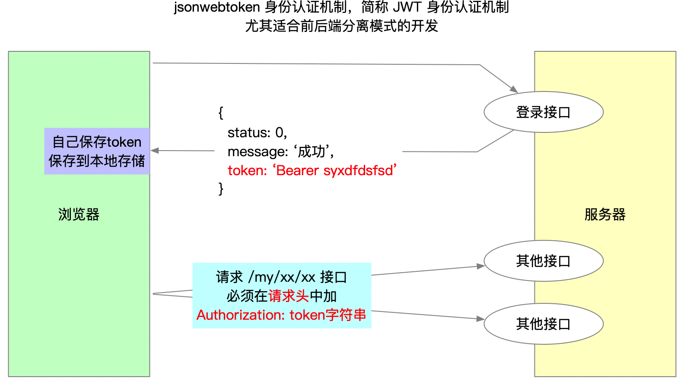
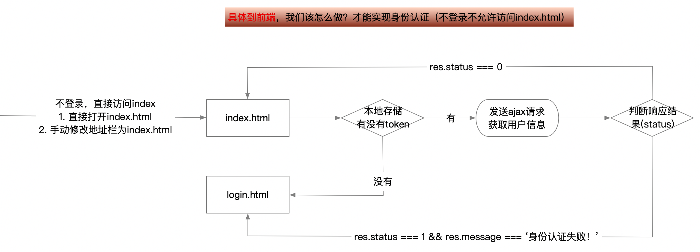

## 后台首页

### 页面布局

- 到layui官网，文档-->页面元素-->布局-->后台布局。
- 复制后台布局 **全部** 的代码，粘贴到你的 index.html 中。
- 修改layui.css 和 layui.all.js 的路径。
  - 去掉复制过来的全部JS相关代码
  - 更换成我们自己的 layui.all.js 即可。
- 至此，index.html 页面布局基本上就实现了。

### 头部处理

- 不对的换掉
- 不要的删除

### 侧边栏导航处理

- 自行调整成和线上效果一样的结构（调整顺序）
- 给“首页” 添加 `layui-this` 类，表示默认该项选中
- 去掉 文章管理 的 “`layui-nav-itemed`” 类，刷新后，该项为收缩状态
- 给 ul 添加 `lay-shrink="all"` **属性**，则会出现排他(手风琴)效果。

### 创建文件，加载css和js

上面能够修改的都已经修改完毕了，接下来需要的样式需要我们自己编写了，所以不得不创建自己的JS文件和CSS文件了。**记得加载他们，包括common.js。**

- 创建了 /assets/css/index.css
- 创建了 /assets/js/index.js

### 使用字体图标

```html
<a href=""><i class="layui-icon layui-icon-logout"></i>退出</a>

<a href=""><i class="layui-icon layui-icon-home"></i>首页</a>

<a class="" href="javascript:;"><i class="layui-icon layui-icon-form"></i>文章管理</a>

<a href="javascript:;"><i class="layui-icon layui-icon-username"></i>个人中心</a>

子菜单全部一致
<a href="javascript:;"><i class="layui-icon layui-icon-app"></i>列表一</a>
```

CSS样式：

```css
/* 所有菜单的调整 */
.layui-icon {
    margin: 0 5px;
    font-size: 16px;
}

/* 单独调整子菜单 */
.layui-icon-app {
    margin-left: 20px;
}
```


### 头像处理

- 头部的头像和侧边栏的头像一样

- 复制头部区域的 a 标签，放到侧边栏开始的位置，修改a标签为div

- 自定义类。并添加样式，完成最终的效果。

  ```html
  <!-- 侧边栏代码 -->
  <div class="userinfo" href="javascript:;">
      
      个人中心
  </div>
  ```

  ```css
  /* 侧边栏的头像位置 div */
  div.userinfo {
      height: 60px;
      text-align: center;
      line-height: 60px;
  }
  ```

- 设置欢迎语

  ```html
  <div class="userinfo">
      
      欢迎你<span class="username">老汤</span>
  </div>
  ```

- 设置文字头像

  因为新注册的账号没有图片类型的头像，所以取用户名的第一个字符当做头像。

  如果后续，用户更换了图片头像，那么就显示图片头像。

  ```html
  <!--    头部  --- 添加 span.text-avatar 标签    -->
  <a href="javascript:;">
      <span class="text-avatar">A</span>
      
      个人中心
  </a>
  <!--    侧边栏 --- 添加 span.text-avatar 标签   -->
  <div class="userinfo">
      <span class="text-avatar">A</span>
      
      欢迎你<span class="username">老汤</span>
  </div>
  ```

  ```css
  /* 字体头像 */
  .text-avatar {
      width: 30px;
      height: 30px;
      text-align: center;
      line-height: 30px;
      font-size: 20px;
      color: #fff;
      background-color: #419488;
      display: inline-block;
      border-radius: 50%;
  }
  
  /* 默认隐藏两个头像 */
  .text-head, .layui-nav-img {
      display: none;
  }
  ```

### 首页获取用户信息并渲染

> 开发之前，记得把jQuery和自己的js先加载好

- 封装一个函数 `getUserInfo()`，完成ajax请求，获取用户信息并渲染
- `getUserInfo()` 函数要放到入口函数外部
  - 封装成函数，后续，其他页面会使用
- 发送请求的时候，必须在请求头中，携带token，已在 common.js 中配置
- 渲染
  - 设置欢迎语
    - 优先使用昵称，没有昵称则使用登录账号
  - 设置头像
    - 优先使用图片，没有图片，则使用名字的第一个字符
    - 设置字体头像的时候，不要用show()方法，要自己设置css样式

```js
function getUserInfo() {
  $.ajax({
    url: 'http://www.itcbc.com:8080/my/user/userinfo',
    success: function (res) {
      // console.log(res);
      if (res.status === 0) {
        // 1. 设置欢迎你，xxx(优先使用昵称)
        var name = res.data.nickname || res.data.username;
        $('.username').text(name);

        // 2. 设置头像（优先使用图片）
        if (res.data.user_pic) {
          // 说明有图片
          $('.layui-nav-img').attr('src', res.data.user_pic).show();
          $('.text-avatar').hide();
        } else {
          // 说明没有图片(截取名字的第一个字，转大写)
          var first = name.substr(0, 1).toUpperCase();
          // show方法作用是恢复元素默认的样式（span默认就是行内元素，show会把span设置为display:inline；div默认是块级元素，show会把div设置为display: block）
          $('.text-avatar').text(first).css('display', 'inline-block');
        }
      }
    },
    // 必须加如下请求头，否则会提示身份认证失败
		headers: {
      Authorization: localStorage.getItem('token')
    },
   	// 如果恰好在获取用户信息时，token过期了，就不会获取到正确的响应，而是得到身份认证失败的响应，所以当请求完成后，判断一下
    complete: function (xhr) {
      var res = xhr.responseJSON;
      if (res && res.status === 1 && res.message === '身份认证失败！') {
        // 移除过期的token
        localStorage.removeItem('token');
        // 跳转到登录页
        location.href = './login.html';
      }
    }
  });
}
getUserInfo();

```

### 退出功能

- 退出超链接
  - 加入 id="logout"
  - href="javascript:;"    这点一定要注意，必填
- 点击退出
  - 询问
  - 删除token
  - 跳转到 login.html

```js
// --------------  退出功能 ---------------------
// 退出的时候，两个操作
// - 删除token
// - 页面跳转到登录页面
$('#logout').click(function () {
    // 弹出层，询问是否要退出
    layer.confirm('你确定退出吗？', function (index) {
        //do something
        // 如果点击了确定，删除token，页面跳转
        localStorage.removeItem('token');
        location.href = './login.html';
        layer.close(index); // 关闭当前弹出层
    });
});
```

## 身份认证

### JWT身份认证原理



### 具体到前端，该如何认证



小结：具体到前端，我们应该做：

1. 登录成功后，要在本地存储中保存token
2. 发送Ajax请求的时候，必须在请求头携带 `Authorization: token字符串`
3. index.html 开头，加入判断，判断本地存储中是否有token
4. 根据服务器返回的结果，判断token的真假。

### 创建项目通用的JS文件

项目的Ajax请求根路径 为 http://www.itcbc.com:8080 。所以，可以创建 *assets/js/common.js* 。在该js文件中 使用jQuery提供的 `$.ajaxPrefilter()` 方法统一配置大事件项目的接口根路径、headers和complete。

***/assets/js/common.js***

```js
// 全局变量 baseUrl，以便后续多次使用
let baseUrl = 'http://www.itcbc.com:8080';

$.ajaxPrefilter(function (option) {
    // option 就是ajax选项；我们可以修改它，也可以增加一些选项
    // 1. 统一配置url
    option.url = baseUrl + option.url;

    // 2. 统一配置请求头
    option.headers = {
        Authorization: localStorage.getItem('token')
    };
    
    // 3. 请求完成后，如果接口返回“身份认证失败”，则需要跳转到登录页面
    option.complete = function (xhr) {
        var res = xhr.responseJSON;
        if (res && res.status === 1 && res.message === '身份认证失败！') {
            localStorage.removeItem('token');
            location.href = './login.html';
        }
    }
});
```

> 配置好之后，各个页面，在调用接口之前，只需要提前加载好common.js即可

