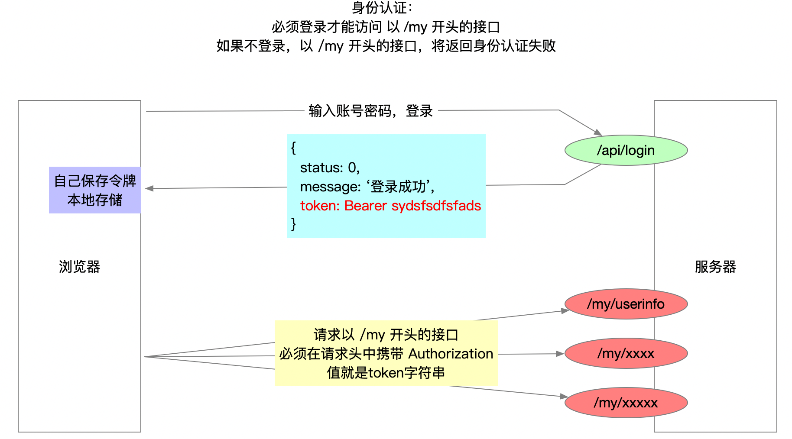

## 项目说明

- 案例需要完成对数据的**增删改查**4项操作。其中查询、添加、删除我们都已经做过。
- 案例采用**身份认证**方式，即必须登录，才能完成数据的增删改查。
- 登录后，只能操作自己的数据。即只能看到自己添加的数据，只能删除自己的数据，只能修改自己的数据。

案例接口文档：https://docs.apipost.cn/view/8675137ccc2b3ac0#3361314

线上演示地址：http://www.itcbc.com:8888/login.html

## 安装vscode的live server插件

### 安装


### 作用

- 模拟真实环境（服务器环境）打开页面。
- 修改页面后，浏览器会自动刷新。

### 使用

安装后，**编辑器**打开**html文件**，点击右键菜单的 “**Open with Live Server**”，就会在浏览器预览页面了。

使用 Live Server 插件打开HTML之后，浏览器地址栏一般都会显示 `127.0.0.1:5500/xxx.html`

### 必须使用live server的硬性条件

1. 大事件中，有一个**图片剪裁插件**，必须使用live server的方式打开页面

2. 项目使用了iframe标签，并且涉及到调用父页面的函数，必须使用live server的方式打开页面

### 易错点和注意事项

1. 该插件的快捷键不是 Alt + B，不要按照之前的思维打开你的页面，需要慢慢适应。

2. 如果你的live server不能用，安装 preview on web server 插件也可以，安装之后，**编辑器**打开**html文件**，点击右键菜单的 “**vscode-preview-server：Launch on browser**”，就会在浏览器预览页面了。

## 搭建项目目录

- 创建 `bigevent` 文件夹，它就是我们的项目文件夹
- 把 `资料` 里面的 `assets` 和 `home` 复制到 `bigevent` 里面
- vscode打开 bigevent 文件夹

```
|- home
	|- dashboard.html      ---    后台首页图表页面
|- assets
	|- js                  ---    空文件夹，里面准备存放自己写的js文件
	|- css                 ---    空文件夹，里面准备存放自己写的css文件
	|- images              ---    存放的页面布局所需的图片
	|- lib                 ---    存放第三方工具
		|- jquery.js
		|- template-web.js
		|- layui
		|- tinymce         ---    富文本编辑器插件，添加文章时使用
		|- cropper         ---    图片剪裁插件（更换头像、添加文章使用）
```

## layui介绍

### 介绍

类似于bootstrap，[layui](https://www.layui.com/)是一个经典模块化前端框架。

- 提供了大量基础类（比如背景颜色、布局、文字等），写页面的时候，可以直接使用这些类。
- **页面元素**，可以轻松做出 [图标](https://www.layui.com/doc/element/icon.html)、[按钮](https://www.layui.com/doc/element/button.html)、[表单](https://www.layui.com/doc/element/form.html)、[表格](https://www.layui.com/doc/element/table.html)、[面板](https://www.layui.com/doc/element/panel.html)等页面元素。
- **内置模块**，可以轻松实现网页常用功能，比如[表单验证](https://www.layui.com/doc/modules/form.html#verify)、[分页](https://www.layui.com/doc/modules/laypage.html)、[流加载](https://www.layui.com/doc/modules/flow.html)、[弹出层](https://www.layui.com/doc/modules/layer.html)、[轮播图](https://www.layui.com/doc/modules/carousel.html)等效果。

[详细的文档](https://www.layui.com/doc/)，让我们使用起来得心应手。

### 使用

- 如果只是做页面布局，一般只需要加载 /lib/layui/css/layui.css 即可。
- 如果涉及到功能（比如弹出层等），还需要加载 /lib/layui/js/layui.all.js 文件。

## 使用Git管理项目

- 初始化   `git init`
- 添加基础的代码 到 暂存区 `git add .`
- 提交代码到本地仓库  `git commit -m '提交了基础的代码'`
- 创建远程仓库（自愿创建码云或github仓库）
- 添加远程仓库地址 `git remote add 别名 地址`
- 首次推送 `git push -u 别名 master`

具体操作：

```bash
# 项目即推送到码云、也推送到github

# 初始化
git init

# 添加初始文件到暂存区（windows可能看的一堆警告，没有问题，正常）
git add .

# 提交文件到本地仓库
git commit -m '提交了初始的文件'

# 创建远程仓库

# 添加两个远程仓库的 ssh地址
git remote add o1 git@gitee.com:laotang1234/bigevent-123.git
git remote add o2 git@github.com:Laotang1234/bigevent-123.git

# 推送到码云
git push -u o1 master

# 推送到github
git push -u o2 master
```

> 后续，新增了什么功能，及时的让Git记录。

## 登录和注册页面处理

### 准备工作

在 `bigevent` 根目录中

- 创建 login.html （登录注册页面）
- 创建 /assets/css/login.css
- 创建 /assets/js/login.js
- 加载所需的css和js文件

***login.html***

```html
<title>Document</title>
<!-- 无论是css还是js，都需要先加载别人的css和js，最后加载自己的css和自己的js -->

<!-- 加载css文件 -->
<link rel="stylesheet" href="./assets/lib/layui/css/layui.css">
<link rel="stylesheet" href="./assets/css/login.css">


<!-- body区，加载js文件 -->
<script src="./assets/lib/jquery.js"></script>
<script src="./assets/lib/layui/layui.all.js"></script>
<script src="./assets/js/common.js"></script>
<script src="./assets/js/login.js"></script>
```

### 页面布局

***login.html***

```html
<body>

    <!-- logo图片 -->
    


    <!-- 登录的盒子 start -->
    <div class="box login">
        <div class="title">大事件后台管理系统</div>
        <!-- 登录的表单 start -->
        <form class="layui-form" action="">
            <!-- 第一项：用户名 -->
            <div class="layui-form-item">
                <i class="layui-icon layui-icon-username"></i>
                <input type="text" name="title" required lay-verify="required" placeholder="请输入用户名" autocomplete="off"
                    class="layui-input">
            </div>
            <!-- 第二项：密码 -->
            <div class="layui-form-item">
                <i class="layui-icon layui-icon-password"></i>
                <input type="text" name="title" required lay-verify="required" placeholder="请输入密码" autocomplete="off"
                    class="layui-input">
            </div>
            <!-- 第三项：按钮 -->
            <div class="layui-form-item">
                <button class="layui-btn layui-btn-fluid layui-bg-blue" lay-submit lay-filter="formDemo">登录</button>
            </div>
            <!-- 第四项：超链接 -->
            <div class="layui-form-item">
                <a href="javascript:;">去注册账号</a>
            </div>
        </form>
        <!-- 登录的表单 end -->
    </div>
    <!-- 登录的盒子 end -->


    <!-- 注册的盒子 start -->
    <div class="box register">
        <div class="title">大事件后台管理系统</div>
        <!-- 注册的表单 start -->
        <form class="layui-form" action="">
            <!-- 第一项：用户名 -->
            <div class="layui-form-item">
                <i class="layui-icon layui-icon-username"></i>
                <input type="text" name="title" required lay-verify="required" placeholder="请输入用户名" autocomplete="off"
                    class="layui-input">
            </div>
            <!-- 第二项：密码 -->
            <div class="layui-form-item">
                <i class="layui-icon layui-icon-password"></i>
                <input type="text" name="title" required lay-verify="required" placeholder="请输入密码" autocomplete="off"
                    class="layui-input">
            </div>
            <!-- 第三项：确认密码 -->
            <div class="layui-form-item">
                <i class="layui-icon layui-icon-password"></i>
                <input type="text" name="title" required lay-verify="required" placeholder="请输入确认密码" autocomplete="off"
                    class="layui-input">
            </div>
            <!-- 第四项：按钮 -->
            <div class="layui-form-item">
                <button class="layui-btn layui-btn-fluid layui-bg-blue" lay-submit lay-filter="formDemo">注册</button>
            </div>
            <!-- 第五项：超链接 -->
            <div class="layui-form-item">
                <a href="javascript:;">去登录</a>
            </div>
        </form>
        <!-- 注册的表单 end -->
    </div>
    <!-- 注册的盒子 end -->


    <script src="./assets/lib/layui/layui.all.js"></script>
    <script src="./assets/lib/jquery.js"></script>
    <script src="./assets/js/common.js"></script>
    <script src="./assets/js/login.js"></script>
</body>
```

CSS代码：

```css
html, body {
    height: 100%;
}

body {
    background-color: #5ea0f1;
}

#logo {
    margin: 20px 0 0 240px;
}

/* 登录和注册盒子 */
.box {
    height: 310px;
    width: 400px;
    background-color: #f5da78;
    position: absolute;
    left: 50%;
    top: 50%;
    transform: translate(-50%, -50%);
    box-shadow: 5px 5px 5px 5px;
}

.title {
    height: 60px;
    line-height: 60px;
    text-align: center;
    font-size: 26px;
}

/* 表单 */
form {
    margin: 0 30px;
}

form a {
    float: right;
}

/* 字体图标 */
.layui-form-item {
    position: relative;
}

.layui-icon {
    position: absolute;
    left: 6px;
    top: 11px;
}

.layui-input {
    padding-left: 24px;
}

/* 默认，让注册的盒子隐藏 */
.register {
    display: none;
}
```


### 切换登录和注册的盒子

```js
// --------------------- 切换登录和注册的盒子 --------------------
$('.login a').click(function () {
    $('.register').show().prev().hide();
});

$('.register a').click(function () {
    $('.login').show().next().hide();
});
```

## 注册功能

### 完成注册功能

- 注意serialize() 是根据表单项的name属性值获取值的
- 一定要检查表单项的name属性，是否和接口要求的请求参数一致

```js
// ----------------------   注册功能  ----------------------
// 表单提交 -> 阻止默认行为 -> 收集表单数据（查询字符串） -> ajax提交
$('.register form').on('submit', function (e) {
    e.preventDefault();
    var data = $(this).serialize();
    // console.log(data);
    $.ajax({
        type: 'POST',
        url: 'http://www.itcbc.com:8080/api/reguser',
        data: data,
        success: function (res) {
            // 提示
            layer.msg(res.message);
            if (res.status === 0) {
                // 清空输入框。找到表单，转成DOM对象，调用DOM方法reset，来重置表单
                $('.register form')[0].reset();
                // 切换到登录的盒子
                $('.login').show().next().hide();
            }
        }
    })
});
```

如果注册的用户名重复了，但是没有提示。因为如果用户名重复，服务器返回的状态码是500，$.ajax里面的success函数就不会执行了。

所以要加一个 error（请求出错时执行） 或者 complete（请求完成后执行），用于错误提示。

```js
error: function (xhr) {
    var res = xhr.responseJSON;
    // -------------------  错误提示  -----------------------
    if (res && res.status === 1) {
        layer.msg(res.message);
    }
}
```


## 表单验证

### 内置验证规则使用方法

**layui -> 文档 -> 左侧边栏（内置模块） --> 表单 --> 右（目录）--> 表单验证。**

layui提供了表单验证规则。使用方法：

```html
<input type="text" lay-verify="验证规则|验证规则|验证规则" />
```

layui提供了几个内置的验证规则：

- required（必填项）
- phone（手机号）
- email（邮箱）
- url（网址）
- number（数字）
- date（日期）
- identity（身份证）

比如，一个输入框必填、必填保证邮箱格式，代码如下：

```html
<input type="text" lay-verify="required|email" />
```

### 自定义验证规则

layui支持自定义验证规则。

```js
// ----------------------   自定义表单验证  ----------------------
// 必须使用 layui 的内置模块 - form 模块
// 只要使用layui的模块，必须加载模块
var form = layui.form;  // 加载form模块
// var laypage = layui.laypage; // =加载laypage分页模块
// var tree = layui.tree; // 加载树形组件模块

// 调用 form 模块内置方法verify，自定义验证规则
form.verify({
    // 键(验证规则): 值(验证方法)
    
    // 比如验证用户名长度2~10位，只能是数字字母组合
    // user: [/正则表达式/, '验证不通过时的提示']
    user: [/^[a-zA-Z0-9]{2,10}$/, '用户名只能是数字字母，且2~10位'], // {2,10} 不是 {2, 10}

    len: [/^\S{6,12}$/, '密码6~12位且不能有空格'],

    same: function (val) {
        // 形参，表示使用该验证规则的输入框的值（谁用这个验证规则，val表示谁的值）
        // 案例中，重复密码使用了这个验证规则，所以形参val表示输入的重复密码
        if (val !== $('.pwd').val()) {
            // return '错误提示'
            return '两次密码不一致'
        }
    }
    
});
```

定义完验证规则之后，在HTML页面中，使用该验证规则即可，如下：

```html
用户名
<input type="text" lay-verify="required|user" />
密码框
<input type="password" lay-verify="required|len" />
重复密码框
<input type="password" lay-verify="required|len|same" />
```

### 细节问题

- 表单（form标签）必须有 layui-form 这个类。

- 按钮必须是submit类型的，如果按钮没有指定type，就是提交按钮，那么默认就是submit类型的

- 按钮必须有 lay-submit 属性，注意是属性，不是类。

- HTML中使用验证规则

    - 无论用的内置的验证规则，还是自定义的验证规则，用法都一样。
    - `<input lay-verify="验证规则|验证规则" />`
    - `<input lay-verify="required|email|len|same" />`

- 编写自定义验证规则，需加载 form 模块；（硬性要求：使用layui的模块，必须先加载）

    - `var 变量 = layui.模块名;`
    - `var form = layui.form;`  // 加载得到一个对象

    - 加载得到的 form 模块，是一个对象，该对象内置一个verify方法，我们调用它编写自定义验证规则。

## 登录功能

### 完成登录功能

```js
// ----------------------   登录功能  ----------------------
// 表单提交 -> 阻止默认行为 -> 收集表单数据（查询字符串） -> ajax提交
$('.login form').on('submit', function (e) {
    e.preventDefault();
    var data = $(this).serialize();  // 必须检查name属性值
    $.ajax({
        type: 'POST',
        url: 'http://www.itcbc.com:8080/api/login',
        data: data,
        success: function (res) {
            layer.msg(res.message);
            if (res.status === 0) {
                // 登录成功，保存token
                localStorage.setItem('token', res.token);
                // 跳转到首页面 index.html
                location.href = './index.html';
            }
        }
    });
})
```

### layer弹出层

可以在[layui官网](https://www.layui.com/)查看弹出层模块的使用，也可以直接进入 [layer 独立版本](https://layer.layui.com/)演示网站。

我们在html中加载的是 `layui.all.js`，则可以直接使用layer模块，无需加载。

```js
layer.msg() // 方法的作用是在页面中提示一个消息，3秒后自动关闭这个消息框

// 示例如下：
layer.msg('xxxxx');

// 项目中可以使用如下代码：
layer.msg(res.message);
```

### token的作用

当我们登录成功之后，服务器返回了一个token字符串。

token是一个令牌，访问以 `/my` 开头的接口的时候，必须携带token，否则会提示身份认证失败。

所以，登录成功之后，获取到token，浏览器端（客户端）需要保存token，以便于后续请求使用。



> 所以，登录成功后，我们能做的就是把 token 保存到本地存储中：`localStorage.setItem('token', res.token)`

