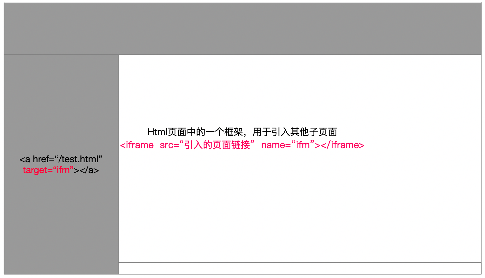
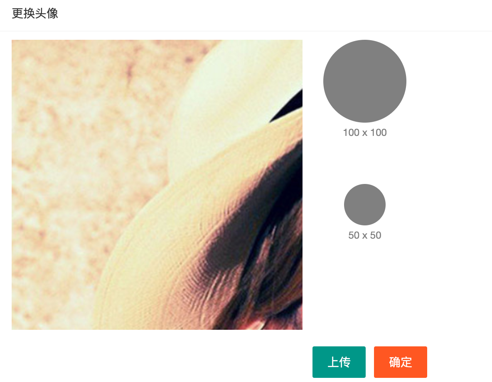

## 小页面的处理

### 文件存放思路

如果继续把html文件存放到项目根目录，那么根目录的文件会越来越多，会越来越乱，所以建议单独存放个人中心相关的几个页面。老师的做法如下（仅供参考）

- html 放到根目录下的user文件夹，比如 更新用户信息页面 user/userinfo.html

- css，也要放到 user/css 文件夹 ，比如 更新用户信息的css，user/css/userinfo.css

- js，也要放到 user/js/ 这里，比如 更新用户信息的js，user/js/userinfo.js


### 首页内容区说明

使用iframe标签

- iframe标签是HTML标签
- iframe在整个页面（父页面）中，占用一个区域，这个区域可以引入其他（子）页面
- src属性用于引入默认的子页面
- 侧边栏的 a 标签，href属性正常挂链接
- 侧边栏的 a 标签，target属性，表示打开新页面的位置；
- 通过指定 `target=“iframe标签的name值”` ，可以在iframe区域打开链接的页面




## 基本资料

### 准备工作

- 创建HTML文件、css文件、js文件
    - 创建 /user/userinfo.html
    - 创建 /user/css/userinfo.css
    - 创建 /user/js/userinfo.js
- index.html 头部和侧边栏，挂超链接，链接到 ./user/userinfo.html，注意target="fm"

### 页面布局

略（因为是复制过来的）

只需要修改一下页面中的文字、修改一下类名、name属性值等等

- 修改了input的name属性值（分别是username、nickname、email）
- 设置登录账号这个input disable属性，因为修改的时候，不允许修改登录账号
- 给邮箱加一个email验证规则

### 为表单赋值(数据回填)

思路：

- 发送ajax请求，获取用户信息
- 设置表单各项（每个输入框）的value值。

具体步骤：

- 需要在 form 中，添加一个隐藏域，用于保存id值，前面已经添加过了

    ```html
    <input type="hidden" name="id" />
    <!-- 隐藏域，只要放到 form 里面即可 -->
    ```

- 先设置表单各项的 name 属性（username/nickname/email/id）

- 发送ajax请求，获取用户信息

- 使用layui的from模块快速为表单赋值

    - 为表单（form标签）设置 `lay-filter="user"` ，值随便定义，我这里使用的是 user
    - JS代码中，一行代码为表单赋值

    ```js
    let form = layui.form;
    form.val('user', res.data);
    ```

    - `要求，res.data 这个对象的属性（key）要和表单各项的name属性值相同，才能赋值`

完整的代码：

```js
// 加载layui的form模块
var form = layui.form;

// ------------------ 完成数据回填 -------------------------
function renderUser () {
    $.ajax({
        url: '/my/user/userinfo',
        success: function (res) {
            // console.log(res)
            if (res.status === 0) {
                // 数据回填
                // $('input[name=username]').val(res.data.username);
                // $('input[name=nickname]').val(res.data.nickname);
                // $('input[name=email]').val(res.data.email);
                // $('input[name=id]').val(res.data.id);
                // 使用layui提供的数据回填方法
                // form.val('表单的lay-filter属性值', '对象形式的数据(对象的key要和表单各项的name属性值相同)');
                form.val('user', res.data);
            }
        }
    })
}
renderUser();
```


> 只要是修改操作：
>
> 1. 必须要进行数据回填操作，保证输入框是有值的
> 2. 修改的表单中，一般都有隐藏域 id

### 完成更新用户信息的功能

- 设置 登录账号为 `disabled` 
    - 不允许修改
    - 通过 $('form').serialize() 不能获取到 username 值，刚刚好是我们的需要。
- 注册表单的提交事件
- 阻止默认行为
- 收集表单数据，使用 $('form').serialize() 。（id、nickname、email）
- 发送ajax请求，完成更新
- 更新成功之后，提示，并且调用父页面的 `getUserInfo()` 从新渲染用户的头像

```js
// ------------------   表单提交的时候，完成用户信息的更新 -----------------
// 监听表单的提交事件。
$('form').on('submit', function (e) {

    // 阻止默认行为
    e.preventDefault();
    // 获取id、nickname、email的值
    var data = $(this).serialize();
    // console.log(data);
    // ajax提交给接口，从而完成更新
    $.ajax({
        type: 'POST',
        url: '/my/user/userinfo',
        data: data,
        success: function (res) {
            // 无论成功还是失败，都要提示
            layer.msg(res.message);
            if (res.status === 0) {
                window.parent.getUserInfo();
            }
        }
    });
});

```


### 重置表单

```js
// ---------------------  重置表单  -------------------------
$('button:contains("重置")').click(function (e) {
    e.preventDefault();
    renderUser(); // 调用renderUser()，为表单重新赋值，就可以恢复成原样
});
```


## 更新密码

### 准备工作

- 创建所需的HTML、js文件、css文件
    - 经过观察，所有小页面的布局都一样，所以这里可以使用 userinfo.css
- 首页侧边栏和头部区域挂好链接
    - href=“./user/repwd.html”
    - target="fm"    fm是iframe的name属性值
- 加载好所需的css和js文件

```html
<!DOCTYPE html>
<html lang="en">
<head>
    <meta charset="UTF-8">
    <meta name="viewport" content="width=device-width, initial-scale=1.0">
    <title>Document</title>
    <link rel="stylesheet" href="/assets/lib/layui/css/layui.css">
    <!-- 因为重置密码页面和基本资料页面样式一样 -->
    <link rel="stylesheet" href="/assets/css/userinfo.css">
</head>
<body>
    
    <!--
	1. html代码，去userinfo.html 中复制
	2. 修改文字
	3. 去掉第一个输入框的 disabled 属性
	4. 去掉 隐藏域id
	5. 修改原密码的name属性为 oldPwd；修改新密码的name为 newPwd；去掉重复密码的name属性
	-->
    
    <script src="/assets/lib/jquery.js"></script>
    <script src="/assets/lib/layui/layui.all.js"></script>
    <script src="/assets/js/common.js"></script>
    <script src="/assets/js/user/repwd.js"></script>
</body>
</html>
```


### 表单验证

```js
// -----------------------   表单验证   -----------------------
var form = layui.form;
// 1. 密码长度6~12位 （三个input都需要用）
// 2. 新密码和原密码不能一样 （新密码使用）
// 3. 两次新密码必须一致 （重复密码使用）

form.verify({
    // 1. 密码长度6~12位 （三个input都需要用）
    len: [/^\S{6,12}$/, '长度必须6~12位且不能出现空格'],

    // 2. 新密码和原密码不能一样 （新密码使用）
    diff: function (val) {
        if (val === $('input[name=oldPwd]').val()) {
            return '新密码不能和原密码一致'
        }
    },

    // 3. 两次新密码必须一致 （重复密码使用）
    same: function (val) {
        if (val !== $('input[name=newPwd]').val()) {
            return '两次新密码不一致';
        }
    }
});
```

- 三个密码框，都使用len这个验证规则
- 新密码，使用diff，这个验证规则
- 确认密码，使用 same 验证规则


### ajax请求，完成更新

```js
// ----------------------- 完成重置密码 -----------------------
$('form').on('submit', function (e) {
    e.preventDefault();
    var data = $(this).serialize();
    $.ajax({
        type: 'POST',
        url: '/my/user/updatepwd',
        data: data,
        success: function (res) {
            layer.msg(res.message);
            if (res.status === 0) {
                // 修改成功后，清空token，跳转到登录页，重新登录
                localStorage.removeItem('token');
                // 让父页面跳转
                window.parent.location.href = '../login.html';
            }
        }
    })
})
```

## 更换头像

### 准备工作

- 创建文件

    - 创建 ./user/avatar.html 
    - 创建 ./user/css/avatar.css 
    - 创建 ./user/js/avatar.js

- index.html 中，侧边栏和头部区域挂好超链接

- avatar.html 中 引入所需的css和js文件

    ```html
    <link rel="stylesheet" href="../assets/lib/layui/css/layui.css">
    <!-- 加载剪裁插件的css -->
    <link rel="stylesheet" href="../assets/lib/cropper/cropper.css">
    <link rel="stylesheet" href="./css/avatar.css">
    
    
    
    <script src="../assets/lib/layui/layui.all.js"></script>
    <script src="../assets/lib/jquery.js"></script>
    <!-- 在jQuery之后，按照顺序加载剪裁插件 -->
    <script src="../assets/lib/cropper/Cropper.js"></script>
    <script src="../assets/lib/cropper/jquery-cropper.js"></script>
    
    <script src="../assets/js/common.js"></script>
    <script src="./js/avatar.js"></script>
    ```
    
    

### 复制HTML和CSS（完成布局）

- 首先，得有一个卡片面板布局（去layui复制）

    ```html
    <div class="layui-card">
      <div class="layui-card-header">卡片面板</div>
      <div class="layui-card-body">
        卡片式面板面板通常用于非白色背景色的主体内<br>
        从而映衬出边框投影
      </div>
    </div>
    ```

- 在卡片面板的 **内容区**，添加如下HTML结构。

    ```html
    <!-- 第一行的图片裁剪和预览区域 -->
      <div class="row1">
        <!-- 图片裁剪区域 -->
        <div class="cropper-box">
          <!-- 这个 img 标签很重要，将来会把它初始化为裁剪区域 -->
          
        </div>
        <!-- 图片的预览区域 -->
        <div class="preview-box">
          <div>
            <!-- 宽高为 100px 的预览区域 -->
            <div class="img-preview w100"></div>
            <p class="size">100 x 100</p>
          </div>
          <div>
            <!-- 宽高为 50px 的预览区域 -->
            <div class="img-preview w50"></div>
            <p class="size">50 x 50</p>
          </div>
        </div>
      </div>
    
      <!-- 第二行的按钮区域 -->
      <div class="row2">
        <button type="button" class="layui-btn">上传</button>
        <button type="button" class="layui-btn layui-btn-danger">确定</button>
      </div>
    ```

- 美化的样式

    ```css
    /* 设置卡片主体区域的宽度 */
    .layui-card-body {
      width: 500px;
    }
    
    /* 设置按钮行的样式 */
    .row2 {
      display: flex;
      justify-content: flex-end;
      margin-top: 20px;
    }
    
    /* 设置裁剪区域的样式 */
    .cropper-box {
      width: 350px;
      height: 350px;
      background-color: cyan;
      overflow: hidden;
    }
    
    /* 设置第一个预览区域的样式 */
    .w100 {
      width: 100px;
      height: 100px;
      background-color: gray;
    }
    
    /* 设置第二个预览区域的样式 */
    .w50 {
      width: 50px;
      height: 50px;
      background-color: gray;
      margin-top: 50px;
    }
    
    /* 设置预览区域下方文本的样式 */
    .size {
      font-size: 12px;
      color: gray;
      text-align: center;
    }
    
    /* 设置图片行的样式 */
    .row1 {
      display: flex;
    }
    
    /* 设置 preview-box 区域的的样式 */
    .preview-box {
      display: flex;
      flex-direction: column;
      flex: 1;
      align-items: center;
    }
    
    /* 设置 img-preview 区域的样式 */
    .img-preview {
      overflow: hidden;
      border-radius: 50%;
    }
    ```

    

- 完成后的效果：




### 创建剪裁区(初始化剪裁区)

- 使用插件 cropper ，提供的方法，实现剪裁区的创建
- 具体做法：
    - 找到剪裁区的图片 （img#image）
    - 设置配置项
    - 调用cropper方法，创建剪裁区

```js
// ---------------  创建剪裁区 ------------------
// - 找到剪裁区的图片 （img#image）
var $image = $('#image');
// - 设置配置项
var option = {
    // 纵横比(宽高比)
    aspectRatio: 1, // 正方形
    // 指定预览区域
    preview: '.img-preview' // 指定预览区的类名（选择器）
};
// - 调用cropper方法，创建剪裁区
$image.cropper(option);

```


### 点击按钮，可选择图片

- html中加入一个隐藏的文件域
- 点击上传按钮的时候，触发文件域的单击事件

```html
<!-- 加一个隐藏的文件域 -->
<!-- multiple 控制文件是否可以多选 -->
<input type="file" id="file" style="display: none;">
<button type="button" class="layui-btn" id="chooseFile">选择头像</button>
<button type="button" class="layui-btn layui-btn-danger" id="sure">确认修改</button>

```

```js
// --------------- 2. 点击选择头像，能够实现选择图片 --------------------
$('#chooseFile').on('click', function () {
    $('#file').trigger('click');
})

```


### 更换图片，重置剪裁区

- 找到选择的文件（文件对象）
- 为文件对象创建一个临时的url
- 更换剪裁区的图片
    - 先销毁原来的剪裁区
    - 更改图片的src属性
    - 重新生成剪裁区

```js
// --------------- 3. 文件域内容改变了，能够更换剪裁区的图片 -------------
$('#file').on('change', function () {
    // console.log(12)
    if (this.files.length > 0) {
        // 3.1 找到文件对象
        // console.dir(this);
        var fileObj = this.files[0];
        // 3.2 为文件对象创建临时的url
        var url = URL.createObjectURL(fileObj);
        // console.log(url);
        // 3.3 更换剪裁区的图片(销毁剪裁框 --> 更换图片 --> 重新生成剪裁框)
        $image.cropper('destroy').attr('src', url).cropper(option);
    }
});

```


### 点击确定，实现剪裁并修改头像

- 调用 cropper 方法，传递 `getCroppedCanvas` 参数，得到一个canvas图片（对象）
- 调用canvas的toDataURL()方法，得到base64格式的图片
- ajax提交即可

```js
// --------------- 4. 点击确认修改按钮，实现更换头像 ------------------
$('#sure').on('click', function () {
    // 1. 剪裁图片，得到canvas
    var canvas = $image.cropper('getCroppedCanvas', {width: 30, height: 30});
    // 2. 把canvas转成base64格式字符串
    var base64 = canvas.toDataURL();
    // console.log(base64)
    // 3. ajax提交即可
    $.ajax({
        type: 'POST',
        url: '/my/user/avatar',
        data: { avatar: base64 }, // { id: 1 }
        success: function (res) {
            layer.msg(res.message);
            if (res.status === 0) {
                // 更新index.html的头像
                window.parent.getUserInfo();
            }
        }
    })
})
```

### 关于base64格式的图片说明

- base64格式只是图片的一种格式，用字符串表示图片的格式
- base64格式的优点：减少http请求，加快小图片的响应速度，减轻服务器的压力
- base64格式的缺点：体积比正常图片大 30% 左右。
- 如果是小图片，可以使用base64格式，大图片不建议使用了。

> https://www.css-js.com/tools/base64.html
